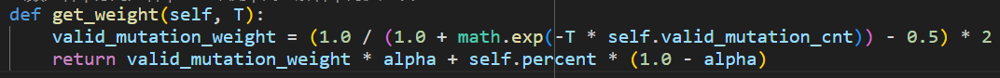
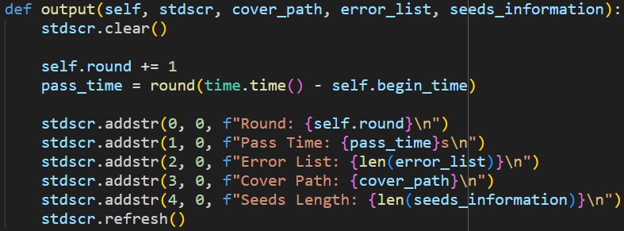

## 配置文件

配置文件中可以对程序的核心参数进行修改

+ program_path：要进行模糊测试的程序路径
+ seeds_path：初始种子路径
+ SCHEDULER_K：种子调度模拟退火算法降温因子
+ SCHEDULER_T：种子调度模拟退火初始温度
+ SCHEDULER_T_MIN：种子调度模拟退火最低温度
+ alpha：权重因子，影响种子的选择概率
+ LARGEST_LENGTH：变异后的最大字符长度
+ USE_NUMBER：布尔值，是否允许变异出数字
+ USE_LOWER_ALPHABET：布尔值，是否允许变异出小写字母
+ USE_UPPER_ALPHABET：布尔值，是否允许变异出大写字母
+ USE_ALL_ASCII：布尔值，是否允许变异出所有ASCII码字符

## 调度器

### 启发式能量调度

​	能量的大小会影响种子的变异次数。程序中，结合了种子平均运行时间，覆盖路径数，被选中的次数来启发式分配能量。初始能量为5。

+ 平均运行时间。运行时间越小，分配的能量越多。
  + 如果平均运行时间小于等于100ms，能量数值*2
  + 如果平均运行时间小于等于200ms，大于等于100ms，能量数值*1.5
+ 覆盖路径数。覆盖路径数越多，分配的能量越多。
  + 如果路径覆盖数小于等于3，能量不变
  + 如果路径覆盖数小于等于7，大于等于4，能量*2
  + 如果路径覆盖数小于等于13，大于等于8，能量*3
  + 如果路径覆盖数小于等于25，大于等于14，能量*4
  + 如果路径覆盖数大于等于25，能量*5
+ 被选中次数。被选中次数越少，分配的能量越多。
  + 如果被选中次数小于等于3，能量*4
  + 如果被选中次数小于等于7，大于等于4，能量*2

### 种子调度

​	运用了模拟退火的思想，在变异早期比较容易接收覆盖率较低的种子，随着变异的进行，将更倾向于选择覆盖率高的种子。

​	模拟退火算法的温度主要会影响种子选择的概率，种子的计算概率如下：

其中，

+ valid_mutation_weight表示有效变异次数产生的权重，值域为[0, 1]。有效变异指的是通过使用该种子进行变异，产生了新的覆盖路径或新的错误。对于有效变异次数越多的种子，应该给予更高的覆盖率。
+ T表示温度，是模拟退火算法的核心参数之一。温度越高，valid_mutation_weight
+ self.valid_mutation_cnt表示该种子产生的有效变异次数。
+ self.percent表示种子的路径覆盖率，值域为[0, 1]。
+ alpha表示权重因子，为valid_mutation_weight和self.percent进行加权，默认值为0.5。

## 输入生成

​	除了任务书中提到的五种变异算子以外，还额外使用了三种变异算子，分别是：

+ char_change：随机变换n个位置的字符。

+ repeat_pattern：随机重复n次长度为L的子串。

+ boundary_change：在字符串的开头或结尾或均随机添加一个字符。

​	部分变异算子不适合对空字符串进行变异，所以程序会判断种子是否为空字符串来筛选可用的变异算子。如果是空串的话，只能使用char_ins、Havoc、Splice、boundary_change中的一种进行变异。

​	选择变异算子的方式借助了python的random库中的choice函数，该函数可以从列表中随机选择一个元素。

​	输入生成模块的设计上借鉴了策略模式，消除了冗杂的if else语句。此外，在添加新的变异算子时，只需要函数名称加进generate函数的function_list中，即可被程序调度，使得程序符合开闭原则。

## 输出器

​	在Python中，`curses`是一个用于创建文本用户界面（TUI）的库。它允许你在终端窗口中创建基本的图形用户界面。在fuzzy-tool中利用`curses`输出运行结果至控制台，避免了控制台的屏闪。

​	输出的内容包含

+ 运行轮数
+ 运行时间
+ 独特的程序崩溃次数
+ 覆盖路径
+ 种子长度

 

