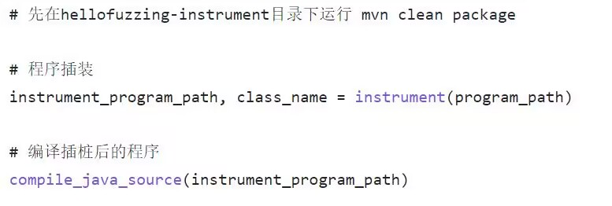

# 软件项目文档

## 一、项目创新点

| 模块 | 创新点 |
| --- | --- |
| 插装模块 | 基于JavaParser静态分析工具对target进行源代码插装，从而可以获取到运行时分支覆盖信息 |
| 能量调度模块 | 基于启发式的能量调度算法，动态分配种子的能量 |
| 种子调度模块 | 利用模拟退火算法进行优化，让覆盖率低的种子在程序运行的早期也有比较高的权重被选中 |
| 输出模块 | 使用curses的创建文本用户界面，解决控制台屏闪<br />输出种子日志信息、有效种子至硬盘中 |

## 二、架构设计
该项目是一个具备反馈机制的基于变异的模糊器，以覆盖率和程序输出作为反馈机制，包括**主程序、插装组件、种子调度组件、输入生成组件、输出分析组件**五大模块：

- **主程序**：
   - **描述**：主程序模块是模糊测试工具的核心控制中心。它负责协调各个模块的工作，管理测试进程，设置测试参数，以及生成测试报告；
   - **功能**：主模糊测试脚本，负责加载用户定义的配置文件，包含命令行界面和模糊测试的主要逻辑，协调整个模糊测试过程；
- **插装组件**：
   - **描述**：接受目标程序的路径和可能的其他配置选项，返回插装后的程序路径或者插装数据，用于；
   - **功能**：在目标应用程序的源代码中插入必要的监控和控制代码，以便进行测试时捕获关键信息和执行流程；
- **种子调度组件**：
   - **描述**：管理和选择种子输入数据，以确保测试用例的多样性和有效性功能：
   - **功能**：根据测试策略和反馈机制，选择合适的种子输入数据，根据已选种子，应用不同的变异策略以生成变异测试用例；
- **种子变异组件**：
   - **描述**：输入生成组件负责使用种子数据生成各种测试用例；
   - **功能**：从目标程序路径中进行读取，跟踪测试用例的执行，记录测试覆盖率信息，并将结果反馈给主程序模块；
- **输出分析组件**：
   - **描述**：输出分析组件负责监视和分析目标应用程序的执行结果；
   - **功能**：监视目标应用程序的执行，捕获执行结果、错误信息、异常情况等，分析目标应用程序的输出，检测潜在的漏洞和安全问题。

项目的架构设计图如下：


## 三、运行流程
该项目的运行流程图如下：


## 四、详细设计
### 4.1 插装部分详细设计
该模块使用 JavaParser 源代码分析工具对待测 target 进行源代码插装（程序转换），使源代码转化为能够提供分支覆盖信息的插装代码。
#### 4.1.1 插装部分结构组织
```
hellofuzzing-instrument
├─ pom.xml
├─ README.md
├─ src
│  ├─ main
│  │  ├─ java
│  │  │  └─ edu
│  │  │     └─ nju
│  │  │        └─ yd
│  │  │           ├─ components
│  │  │           │  └─ Branches.java
│  │  │           ├─ HelloFuzzingInstrument.java
│  │  │           ├─ util
│  │  │           └─ visitor
│  │  │              ├─ collector
│  │  │              └─ generator
│  │  └─ resources
   └─ test
      └─ java
```

- components 目录下的 Branches.java 封装了代码中分支的信息以及对分支代码内容进行插入修改的操作。
- util 目录下存放的是包括 IO 的一些工具类。
- visitor 目录下存放的是根据 JavaParser 特性编写的一些代码访问和插入组件，包括 collector 和generator。
   - collector 负责从抽象语法树中获取感兴趣的代码元模型，例如本项目通过 collector 收集待测 target 中的 if-else 语句(IfStmt)、switch 语句(SwitchEntry)、方法声明语句(MethodDeclaration)等。
   - generator 负责生成一些需要添加到抽象语法树的代码元模型，例如本项目就设计了语句块(BlockStmt)和语句(Stmt)的生成器。
#### 4.1.2 代码详细设计
首先程序需要分析抽象语法树的所有可能存在的分支部分，代码如下：
```java
IfStmtCollector ifStmtCollector = new IfStmtCollector();
ifStmtCollector.visit(cu,this.ifElseStmts);
IOUtil.consoleMessage("find all if-else branches.");
// change one statement to block statement and get if statement and else statement respectively
changeOneStmtToBlock();
//get switch entries
SwitchEntryCollector switchEntryCollector = new SwitchEntryCollector();
switchEntryCollector.visit(cu,this.switchEntries);
IOUtil.consoleMessage("find all switch branches.");
this.num = ifStmts.size()+elseStmts.size()+switchEntries.size();
IOUtil.consoleMessage("find total "+this.num+" branches.");
```
因为实际代码中一些分支语句是单句的形式，没有形成代码块，因此为了将分支部分统一为代码块 `BlockStmt`进行处理，需要一些操作，即上面代码中的 `changeOneStmtToBlock()`方法，详细代码如下：
```java
for(IfStmt ifStmt: ifElseStmts){
    Statement thenStmt = ifStmt.getThenStmt();
    if(!(thenStmt instanceof BlockStmt)){
        NodeList<Statement> statements = new NodeList<>();
        statements.add(thenStmt);
        ifStmt.setThenStmt(BlockStmtGen.blockGenFromStmts(statements));
    }
    ifStmts.add(ifStmt.getThenStmt().asBlockStmt());
    boolean hasElseStmt = ifStmt.getElseStmt().isPresent();
    if(hasElseStmt){
        Statement elseStmt = ifStmt.getElseStmt().get();
        if(!(elseStmt instanceof BlockStmt)){
            NodeList<Statement> statements = new NodeList<>();
            statements.add(elseStmt);
            ifStmt.setElseStmt(BlockStmtGen.blockGenFromStmts(statements));
        }
        elseStmts.add(ifStmt.getElseStmt().get().asBlockStmt());
    }
}
```
本项目是使用一个 char 数组静态实例变量记录 target 的分支覆盖信息，向源代码中插入这个数组的代码如下：
```java
ClassOrInterfaceDeclaration theClass = declarations.get(0);
NodeList charLiteralExprs = new NodeList();
for(int i =0;i<num;i++){
    charLiteralExprs.add(new CharLiteralExpr('0'));
}
theClass.addFieldWithInitializer("char[]","cov_info",new ArrayInitializerExpr(charLiteralExprs), Modifier.publicModifier().getKeyword(),Modifier.staticModifier().getKeyword());
// btw, change class name
String nameBefore = theClass.getNameAsString();
theClass.setName(nameBefore+"HelloFuzzing");
```
本项目选择使用向分支中插入输出流语句来向其他模糊测试组件反映运行时的分支覆盖信息，插入代码如下：
```java
ifStmt.addStatement(0, StmtGen.GenCovInfoChangeStatement(flag++));
ifStmt.addStatement(1, StmtGen.GenPrintCovArrayStatement());
```
上面代码中的 `GenCovInfoChangeStatement()`方法和 `GenPrintCovArrayStatement()`方法是一个使用生成器generator进行代码抽象语法树中组件生成的例子，这些生成器方法的具体实现如下：
```java
public static ExpressionStmt GenCovInfoChangeStatement(int num){
    String s = "cov_info["+num+"] = '1'";
    ExpressionStmt expressionStmt = new ExpressionStmt();
    expressionStmt.setExpression(s);
    return expressionStmt;
}
```
另外，一个 collector 访问器的代码例子如下：
```java
public class MethodDeclarationCollector extends VoidVisitorAdapter<List<MethodDeclaration>> {
    @Override
    public void visit(MethodDeclaration md, List<MethodDeclaration> collector){
        super.visit(md,collector);
        collector.add(md);
    }

}
```
### 4.2 种子变异组件
除了任务书中提到的五种变异算子以外，还额外使用了三种变异算子，分别是：

- char_change：随机变换n个位置的字符。
- repeat_pattern：随机重复n次长度为L的子串。
- boundary_change：在字符串的开头或结尾或均随机添加一个字符。

	部分变异算子不适合对空字符串进行变异，所以程序会判断种子是否为空字符串来筛选可用的变异算子。如果是空串的话，只能使用char_ins、Havoc、Splice、boundary_change中的一种进行变异。
	选择变异算子的方式借助了python的random库中的choice函数，该函数可以从列表中随机选择一个元素。
	输入生成模块的设计上借鉴了策略模式，消除了冗杂的if else语句。此外，在添加新的变异算子时，只需要函数名称加进generate函数的function_list中，即可被程序调度，使得程序符合开闭原则。
### 4.3 输出生成组件
在Python中，curses是一个用于创建文本用户界面（TUI）的库。它允许你在终端窗口中创建基本的图形用户界面。在fuzzy-tool中利用curses输出运行结果至控制台，避免了控制台的屏闪。
     输出的内容包含：

- 运行轮数
- 运行时间
- 独特的程序崩溃次数
- 覆盖路径
- 种子长度


除了在控制台上输出以外，也会将覆盖新的路径或产生新的错误的种子输出至硬盘中进行保留，还会将有效种子的运行日志信息以csv的格式输出至硬盘中。


### 4.4 种子调度组件
#### 4.4.1 种子调度
种子调度里运用了模拟退火的思想。在变异早期比较容易接收覆盖率较低的种子，随着变异的进行，将更倾向于选择覆盖率高的种子。
	模拟退火算法的温度主要会影响种子选择的概率，种子的计算概率如下：

其中，

- valid_mutation_weight表示有效变异次数产生的权重，值域为[0, 1]。有效变异指的是通过使用该种子进行变异，产生了新的覆盖路径或新的错误。对于有效变异次数越多的种子，应该给予更高的覆盖率。
- T表示温度，是模拟退火算法的核心参数之一。温度越高，valid_mutation_weight
- self.valid_mutation_cnt表示该种子产生的有效变异次数。
- self.percent表示种子的路径覆盖率，值域为[0, 1]。
- alpha表示权重因子，为valid_mutation_weight和self.percent进行加权，默认值为0.5。
#### 4.4.2 启发式能量调度
	能量的大小会影响种子的变异次数。程序中，结合了种子平均运行时间，覆盖路径数，被选中的次数来启发式分配能量。初始能量为5。

- 平均运行时间。运行时间越小，分配的能量越多。
   - 如果平均运行时间小于等于100ms，能量数值*2
   - 如果平均运行时间小于等于200ms，大于等于100ms，能量数值*1.5
- 覆盖路径数。覆盖路径数越多，分配的能量越多。
   - 如果路径覆盖数小于等于3，能量不变
   - 如果路径覆盖数小于等于7，大于等于4，能量*2
   - 如果路径覆盖数小于等于13，大于等于8，能量*3
   - 如果路径覆盖数小于等于25，大于等于14，能量*4
   - 如果路径覆盖数大于等于25，能量*5
- 被选中次数。被选中次数越少，分配的能量越多。
   - 如果被选中次数小于等于3，能量*4
   - 如果被选中次数小于等于7，大于等于4，能量*2
### 4.5 配置文件
配置文件中可以对程序的核心参数进行修改

- program_path：要进行模糊测试的程序路径
- seeds_path：初始种子路径
- SCHEDULER_K：种子调度模拟退火算法降温因子
- SCHEDULER_T：种子调度模拟退火初始温度
- SCHEDULER_T_MIN：种子调度模拟退火最低温度
- alpha：权重因子，影响种子的选择概率
- LARGEST_LENGTH：变异后的最大字符长度
- USE_NUMBER：布尔值，是否允许变异出数字
- USE_LOWER_ALPHABET：布尔值，是否允许变异出小写字母
- USE_UPPER_ALPHABET：布尔值，是否允许变异出大写字母
- USE_ALL_ASCII：布尔值，是否允许变异出所有ASCII码字符
### 4.6 主程序设计
#### 4.6.1 插装和编译


#### 4.6.2 计算初始种子的覆盖率

#### 4.6.3 模拟参数为0下的测试

#### 4.6.4 开始模糊测试


#### 4.6.5 不断更新覆盖率和参数


